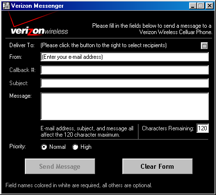



## Verizon Messenger

### Description

This program allows you to send a text message to up to 10 Verizon Wireless subscribers' cell phones.
 
### More Info
 

             |
---                |---
**Submitted On**   |2001-04-03 16:25:28
**By**             |[Sean Ferguson](https://github.com/Planet-Source-Code/PSCIndex/blob/master/ByAuthor/sean-ferguson.md)
**Level**          |Intermediate
**User Rating**    |5.0 (10 globes from 2 users)
**Compatibility**  |VB 6\.0
**Category**       |[Complete Applications](https://github.com/Planet-Source-Code/PSCIndex/blob/master/ByCategory/complete-applications__1-27.md)
**World**          |[Visual Basic](https://github.com/Planet-Source-Code/PSCIndex/blob/master/ByWorld/visual-basic.md)
**Archive File**   |[Verizon Me17868432001\.zip](https://github.com/Planet-Source-Code/sean-ferguson-verizon-messenger__1-22114/archive/master.zip)

